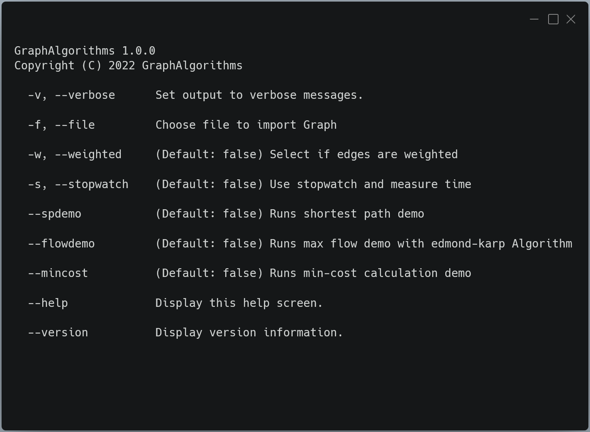

# Standard Graph Algorithms
--- 
This repository contains basic algorithms for graph datastructures

## Datenstrukturen

- [x] unweighted graph
- [x] weighted graph
  
## Algorithms
  
### Traverse
- [x] depth first serach, identify components
- [x] breadth first search, identify components
  
### MST
- [x] prim
- [x] kruskal 
  
  
### TSP
- [x] next neighbour
- [x] doppelter baum
- [x] find all paths
- [x] Branch&Bound

### SP
- [x] dijkstra
- [x] moore-Bellman-Ford
  
### Max-Flows
- [x] edmond-Karp

### Minimum-Cost-Flow
- [x] cycle-canceling
- [x] successive-shortest-path
